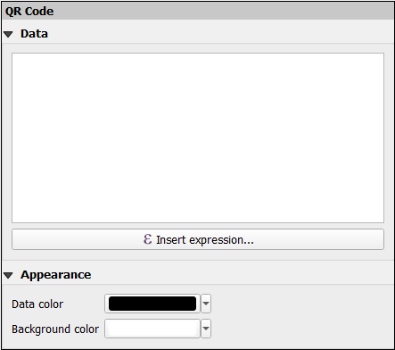

## 1. Overview
Add QR code and linear barcode items to a print or report layout. 
The information for the QR code or barcode can be static or generated from a QGIS expression, with the 
latter also enabling the use of the items in an Atlas context.

## 2. Installation
QGIS 3.6+ needs to be installed, the latest installer is available 
on [this](https://qgis.org/en/site/forusers/download.html) page.

Using the plugin manager in QGIS:
1. Go to **Plugins** > **Manage and Install Plugins...**
2. Click on **Not Installed** and search for `QR Barcode Layout Item`
3. Click on **Install Plugin** to start the download and installation process

## 3. Usage
The QR code and linear barcode items can either be added from the `Add Item` menu or `Toolbox` toolbar in the layout window.

### 3.1 QR Code Item
* [Barcode Data](#qr_code_data)
* [Appearance](#qr_appearance)

The  `QR Code` item enables dynamically-generated QR code images to be added to a layout. The information can be 
generated from alphanumeric text or expressions which can include a custom formula.

Other properties, that are common to layout items such as frame, position, size etc., can be manipulated as defined in the 
[common properties instructions](https://docs.qgis.org/3.10/en/docs/user_manual/print_composer/composer_items/composer_items_options.html#items-common-properties).

#### Data ####

Provide the text or the expression, by clicking on the **Insert expression...** button, that will be used to generate the QR code. Expressions 
need to be surrounded by `[%` and `%]` in order to be interpreted as such. 

More information on 
how to use expressions is available [here](https://docs.qgis.org/3.10/en/docs/user_manual/working_with_vector/expression.html#the-expression-string-builder).

#### Appearance ####

Define the pattern/data and background colors of the QR code by clicking the **Data color** and 
**Background color** buttons respectively.

### 3.2 Linear Barcode Item
* [Properties](#linear_barcode_props)
* [Barcode Data](#linear_barcode_data)

The  `Linear Barcode` item enables dynamically-generated one-dimensional barcodes to be added to a layout. 
It supports the most commonly used linear barcode symbologies, such as as Code 39, EAN, UPC, GS1-128 etc., to be generated from alphanumeric text or expressions depending 
on the allowed types for the given symbology.

Similarly, common properties for a layout item can be defined for the linear barcode item.

#### Properties ####

Set the specific characteristics of the linear barcode symbology. These include:
* **Linear barcode type** - Choose the linear barcode type. The supported types are Code 39, Code 128, GS1-128
* **Add checksum** - Select to calculate and append a checksum in the barcode. Depending on the barcode type, the checksum will be calculated automatically. For some types, 
such as Code 39, the checksum is optional.
* **Render barcode text** - Select to render text under the barcode.

#### Data ####

Provide the text or specify a custom expression, by clicking on the **Insert expression...** button, that will be used to generate the linear barcode. Expressions 
need to be surrounded by `[%` and `%]` in order to be interpreted as such. 

## 4. Issue Reporting
If you find an issue working with the plugin, please report it so that the developer can check and 
fix it. To post it in GitHub, use the following 
link: https://github.com/gkahiu/qrbarcodeitem-plugin/issues.

## 5. License
`QR Barcode Layout Item` is free software. You can redistribute it and/or modify it under the terms of the GNU General 
Public License version 3 (GPLv3) as published by the Free Software Foundation. 

Software distributed under this 
License is distributed on an "AS IS" basis, WITHOUT WARRANTY OF ANY KIND, either express or implied. See LICENSE 
or https://www.gnu.org/licenses/gpl-3.0.en.html for the specific language governing rights and limitations under the License.
